

## Intro 
__This repository contains a CBIR (content-based image retrieval) system__

__Extract query image's feature, and retrieve similar ones from image database__

</img>
<h6><a href='https://winstonhsu.info/2017f-mmai/'>Image src</a></h6>

## Part1: Feature Extraction

In this system, I implement several popular image features:
- color-based
  - [RGB histogram](https://github.com/pochih/CBIR/blob/master/src/color.py)
- texture-based
  - [gabor filter](https://github.com/pochih/CBIR/blob/master/src/gabor.py)
- shape-based
  - [daisy](https://github.com/pochih/CBIR/blob/master/src/daisy.py)
  - [edge histogram](https://github.com/pochih/CBIR/blob/master/src/edge.py)
  - [HOG (histogram of gradient)](https://github.com/pochih/CBIR/blob/master/src/HOG.py)
- deep methods
  - [VGG net](https://github.com/pochih/CBIR/blob/master/src/vggnet.py)
  - [Residual net](https://github.com/pochih/CBIR/blob/master/src/resnet.py)

##### *all features are modulized*

### Feature Fusion
Some features are not robust enough, and turn to feature fusion
- [fusion.py](https://github.com/pochih/CBIR/blob/master/src/fusion.py)

### Dimension Reduction
The curse of dimensionality told that vectors in high dimension will sometimes lose distance property
- [Random Projection](https://github.com/pochih/CBIR/blob/master/src/random_projection.py)

## Part2: Evaluation

CBIR system retrieves images based on __feature similarity__

Robustness of system is evaluated by MMAP (mean MAP), the evaluation formulas is refer to <a href='http://web.stanford.edu/class/cs276/handouts/EvaluationNew-handout-1-per.pdf' target="_blank">here</a>

- image AP   : average of precision at each hit
  - depth=K means the system will return top-K images
  - a correct image in top-K is called a hit
  - AP = (hit1.precision + hit2.precision + ... + hitH.precision) / H
- class1 MAP = (class1.img1.AP + class1.img2.AP + ... + class1.imgM.AP) / M
- MMAP       = (class1.MAP + class2.MAP + ... + classN.MAP) / N

Implementation of evaluation can found at [evaluate.py](https://github.com/pochih/CBIR/blob/master/src/evaluate.py)

My database contains 25 classes, each class with 20 images, 500 images in total, depth=K will return top-K images from database

Method | color | daisy | edge | gabor | HOG | vgg19 | resnet152
--- | --- | --- | --- |--- |--- |--- |---
Mean MAP (depth=10) | 0.614 | 0.468 | 0.301 | 0.346 | 0.450 | 0.914 | 0.944

## Part3: Image Retrieval (return top 5 of each method)
Let me show some results of the system

### query1 - women dress
#### query </img>
#### color 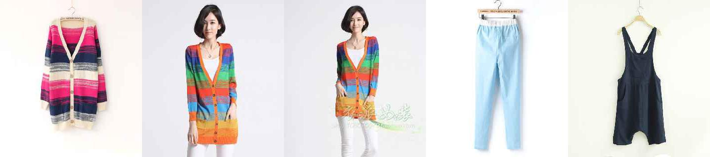</img>
#### daisy 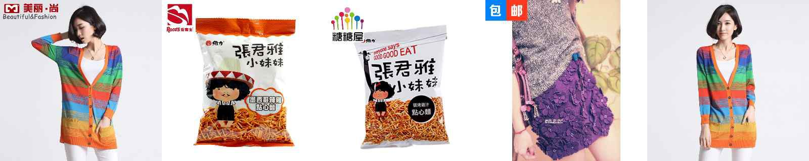</img>
#### edge </img>
#### gabor </img>
#### HOG 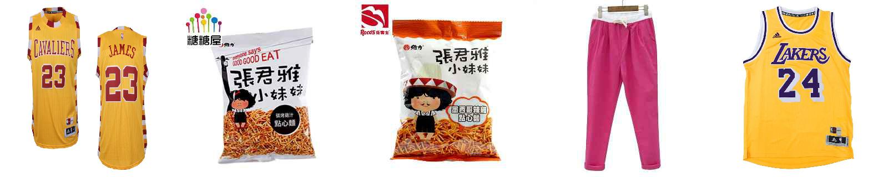</img>
#### VGG19 </img>
#### Resnet152 </img>

### query2 - orange
#### query 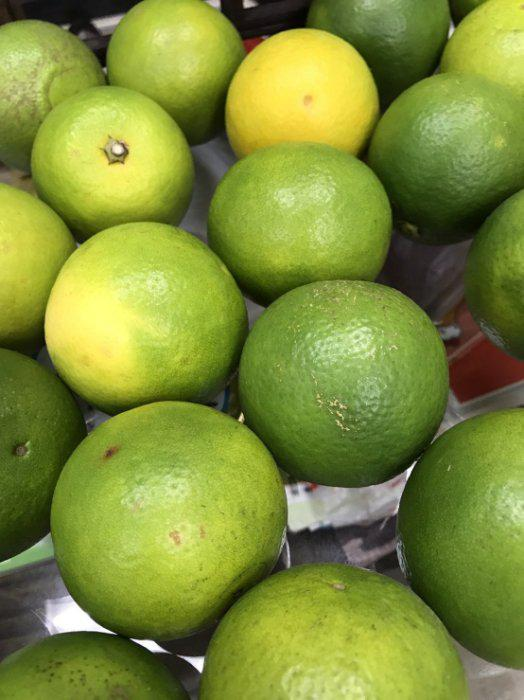</img>
#### color </img>
#### daisy 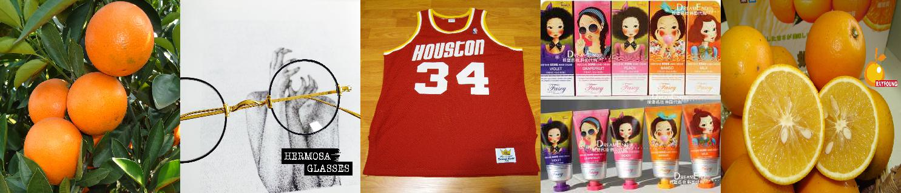</img>
#### edge 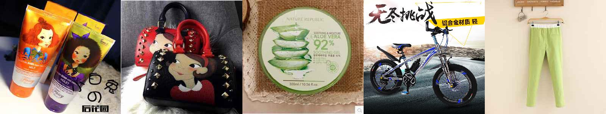</img>
#### gabor 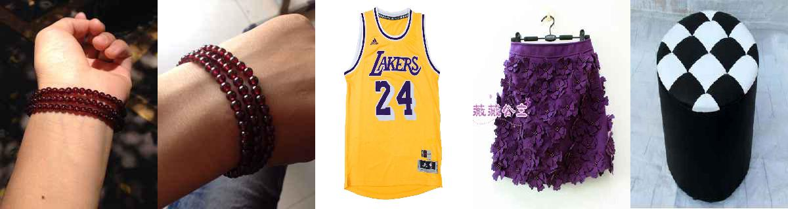</img>
#### HOG 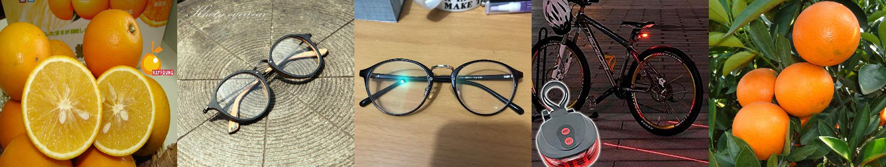</img>
#### VGG19 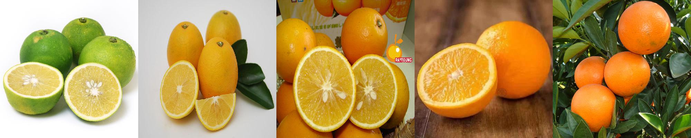</img>
#### Resnet152 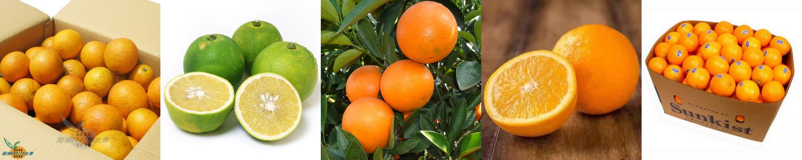</img>

### query3 - NBA jersey
#### query </img>
#### color </img>
#### daisy </img>
#### edge </img>
#### gabor 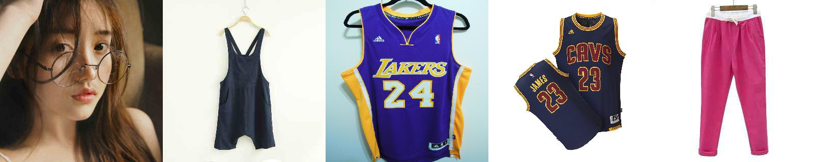</img>
#### HOG 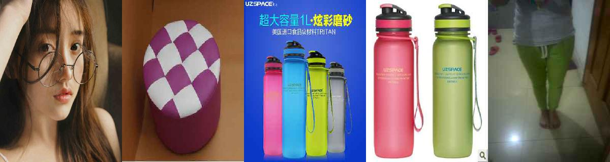</img>
#### VGG19 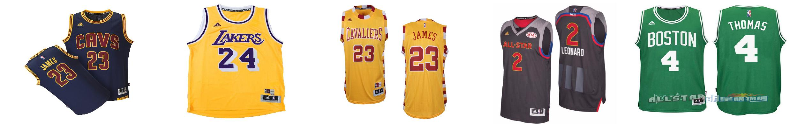</img>
#### Resnet152 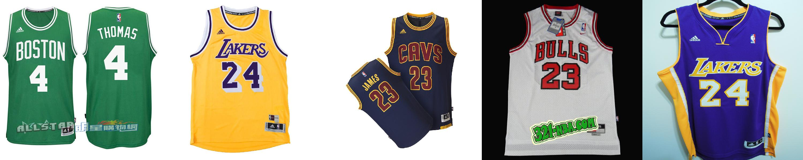</img>

### query4 - snack
#### query 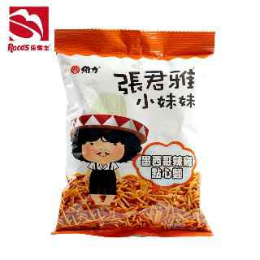</img>
#### color </img>
#### daisy </img>
#### edge </img>
#### gabor </img>
#### HOG 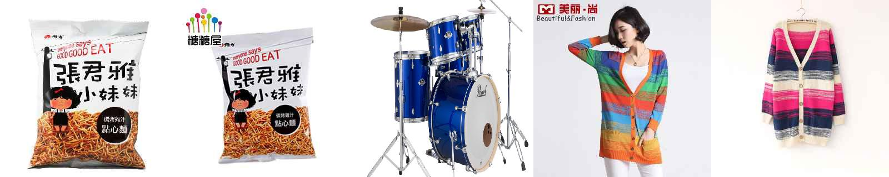</img>
#### VGG19 </img>
#### Resnet152 </img>

## Part4: Usage of Repository
If you are interesting with the results, and want to try your own images,

Please refer to [USAGE.md](https://github.com/pochih/CBIR/blob/master/USAGE.md)

The details are written inside.

## Author
Po-Chih Huang / [@pochih](http://pochih.github.io/)
